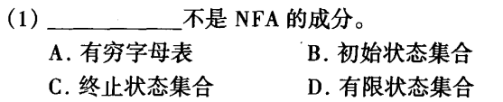
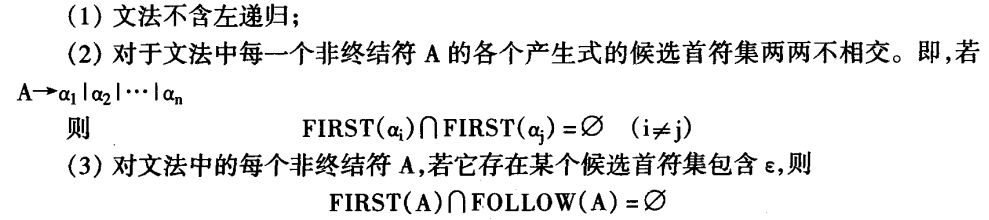
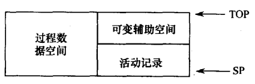
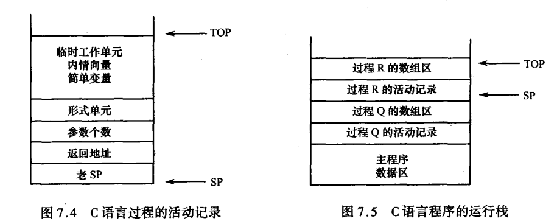

# 📑判断题合集

## 第一章 引论

### **1、程序的执行方式有两种：解释方式和编译方式**

📇考点：二者是否会产生目标代码？各自的优缺点

**（1）解释程序**

- **功能：**源程序的一个执行系统
- **工作结果：**源程序的执行结果
- **实现技术上：**执行中间代码
- **😎优点：**
  - 易于查错 启动速度快
  - 内存使用少
  - 跨平台 移植性好
- **😢缺点：**
  - 效率低，运行速度慢
- 🌰**例子：**Basic、Ruby、Python

**（2）编译程序**

- **功能：**源程序的一个转换系统
- **工作结果：**源程序的目标代码
- **实现技术上：**把中间代码转成目标程序
- **😎优点：**
  - 执行效率高
- **😢缺点：**
  - 在运行中发现的错误必须查找整个程序确定
  - 移植性不好
- 🌰**例子：**Pascal、Fortran、C、Rust

==**Java程序先经过编译，再经过解释**==

### **2、遍**

**定义：**对==**源程序**==或==**源程序的中间结果**==**从头到尾扫描一次，并做相关处理，生成新的中间结果或目标程序**的过程。

一遍扫描的编译程序对源程序扫描一遍，多遍扫描的编译程序对**源程序或源程序的中间结果**扫描多遍

每一遍可完成不同的阶段或多个阶段的工作。

### 3、其他

（1）程序语言是由语法和语义两方面定义的

（2）名字和标识符有区别：名字是语义概念，标识符是语法概念

​	标识符只是一个标志，没有其他含义。名字是用标识符表示的，不仅仅是一个字符串，还具有属性和值。

（3）语法错误可在词法分析和语法分析阶段查出来；

（4）语义错误有些可在编译时查出来，有些则需在运行时才能查出来。

（5）编译阶段的组合

​	编译程序可以从逻辑上分成几个阶段，**对于各个阶段的划分仅仅是指其逻辑结构**，而在具体实现时，经常是将几个阶段组合在一起。例如，可以将各部分组合成前端和后端。

## 第二章 高级语言及其语法描述

### **1、文法和语言**

（1）自然语言是上下文有关的

（2）基于正规文法讨论词法分析问题

（3）基于上下文无关文法讨论语法分析问题

​	程序设计语言不是上下文无关语言，也不是上下文有关语言

​	上下文无关文法有足够能力描述现在多数程序设计语言的语法结构

（4）用正则文法和上下文无关文法描述语言语法，其中上下文有关的问题通过表格处理解决

（5）我们使用的程序语言中，有些语言结构并不是总能用上下文无关文法描述的

（6）若不考虑ε，则上下文有关语言与线性有界自动机等价

（7）0型文法对应于递归可枚举语言，与图灵机等价

（8）正规文法产生的语言都可以用上下文无关文法来描述

（9）上下文无关文法比正规文法有更强的描述能力

### **2、二义性**

（1）如果一个文法的句子（句型）存在两棵语法树，那么该句子是二义性的

（2）如果一个文法包含二义性的句子，则该文法是二义性的，否则该文法是无二义性的

（3）如果语言L找到一个文法是无二义的，则L是无二义的

（4）如果语言L未找到一个文法是二义的，也不能说明L是二义的

（5）若某上下文无关语言的每一个文法都是二义的，则称此语言先天二义的

（6）文法的二义性是不可判定的

（7）一个文法为二义的，则这个文法的每一个句子不一定都对应两个不同的语法树

（8）对于二义文法G，其生成的语言L（G）不一定是二义的

（9）语法树表明了在推导过程中用了哪条规则和使用在哪个非终结符号上，但是它没有表明使用规则（产生式）的顺序

（10）同一句型（句子）可以通过不同的推导序列推导出来

（11）一个句型不一定对应唯一的一棵语法树

（12）一个句型的最左推导/最右推导不一定只有一个

（13）二义文法不一定不是上下无关文法

（14）二义文法的规范归约和规范推导不是互逆的

（15）文法的二义性和语言的二义性是两个不同的概念。语言的二义性是一个更强的概念。

## 第三章 词法分析

### 1、DFA和NFA

（1）一个正规语言只能对应一个最小状态自动机

（2）NFA

- 字母表必须为有穷集合
- **初始状态集合不空**
- 终止状态集合可为空
- 状态集合必须有穷

==**📇题目：**==

**答案：**B（B选项描述的意思是初始状态集合可为空）

（3）对于任何正规表达式e，都存在DFA M，使得L(M)=L(e)

​	对于任何正规表达式e，都存在NFA M，使得L(M)=L(e)

（4）对任何右线性正规文法G，都存在DFA M，使得L(M)=L(G)

​	对任何右线性正规文法G，都存在NFA M，使得L(M)=L(G)

（5）DFA是NFA特例，NFA必然可以接收DFA能接受的语言

（6）一个NFA所接受的语言能被另一个DFA接受

（7）DFA与NFA等价

## 第四章 自上而下分析法

### 1、语法分析

（1）作为语法分析结果的语法分析树与句子的语法树是不同的概念（在算符优先分析法中得到的语法树是不同的，而LL(1)和LR分析法得到的是一样的）

（2）自上而下分析法的基本思想：对任何输入串，试图用一切可能的办法，从文法开始符号（根结点）出发，自上而下地为输入串建立一棵语法树。

​	从推导的角度看，它是从文法的开始符号出发，反复使用各种产生式，寻找与输入串匹配的推导。

（3）对于自上而下分析法，含有左递归的文法将使其陷入无限循环。

（4）满足构造不带回溯的自上而下分析的文法条件是：

（这也是LL(1)文法的条件）

（5）将文法改造成LL(1)文法，必须得要消除文法的左递归再提取公共左因子（因为消除左递归可能引入新的公共左因子）

（6）消除隐含的做左递归算法与非终结符排序方法无关

（7）预测分析法实际上是利用分析表和栈的控制来模拟递归下降分析，这两种自上而下分析方法在本质上是相同的。

## 第五章 自下而上分析法

### 1、基本问题

（1）在”移进-归约“过程中，关键问题是判断栈顶的符号串的可归约性，以及如何进行归约。

（2）在”移进-归约“过程中，如果扫描完所有输入符号，栈中只有文法的开始符号，则语法分析正确结束。

（3）短语是句型的一个字串，构成一个完整的语法单位。（短语的两个条件缺一不可）

（4）在形式语言中，最右推导常被称为规范推导。由规范推导所得到的句型为规范句型。

（5）规范规约得到的语法分析树一定和句子的语法树相同。

（6）自下而上分析法的基本思想：从输入串开始，逐步进行 “归约”，直到文法的开始符号。即从树末端开始，构造语法树。所谓归约，是指根据文法的产生式规则，把产生式的右部替换成左部符号。

### 2、算符优先分析

（1）算符优先文法的两个条件：

- 一个文法，它的任一产生式的右部都不含两个相继（并列）的非终结符➡️算符文法
- 一个算符文法中的任何终结符对之都只满足=，<，>三个关系之一

（2）最左素短语是和算符优先分析算法从左向右扫描、自下而上归约的工作方式相对应的

（3）由于算符优先文法的特性，非终结符对规约没有影响。非终结符根本可以不进符号栈S

（4）算符优先分析一般不等价于规范规约，比规范规约更快

（5）并非所有的优先关系表都存在优先函数

（6）一旦存在优先函数，优先函数就不唯一（无穷多）

（7）优先函数所需要的空间仅O(N)，但是会使得原本不存在优先关系的两个终结符，由于与自然数相对于，变成可比较的了。

（8）在算符优先分析法中，不能按扫描顺序先找到头后找到对应的尾

​	因为在扫描到尾之前不可能确定头在哪里，因为算法不能预知当前算符与后续算符之间是什么关系，而扫描到尾之后可以根据当前算符与前面算符之间的关系来确定谁是最左素短语

### 3、LR分析

（1）LR分析技术是规范规约：

- L是从左到右扫描输入串
- R是构造一个最右推导的逆过程

（2）并非所有上下文无关文法都是LR文法

（3）LR文法肯定是无二义的。一个二义文法绝对不会是LR的

（4）对于一个文法，如果能够构造一张LR分析表，使得它的每个入口均是唯一确定的，则该文法是LR文法

（5）活前缀是规范句型的一个前缀，不含句柄之后的任何符号。

（6）在 LR 分析工作过程中的任何时候，栈里的文法符号（自栈底而上）X₁X₂…Xₘ应该构成活前缀，把输入串的剩余部分配上之后即应成为**规范句型**（如果整个输入串确实构成一个句子）。

➡️只要输入串的已扫描部分保持可归约成一个活前缀，那就意味着所扫描过的部分没有错误。

➡️在分析的过程中，如果分析的句子是正确的，栈里的文法符号（自栈底而上）始终构成活前缀。

（7）LR (1) 分析法中的状态具有更丰富的展望信息，因此 LR (1) 分析法较 SLR 分析法具有更强的冲突消解能力。

（8）LR (0)⊂SLR⊂LR (1)⊂无二义文法。

（9）LR (1) 分析与 SLR (1) 解决办法比较，都是向前展望一个符号。不同之处在于：

- SLR (1) 在每个状态上给出的展望信息来源于 FOLLOW 集合

​	➡️这种展望的信息更广泛、欠精确，发生冲突的可能性也更大

- LR (1) 方法在每个状态上的展望信息都是严格地针对该状态的

​	➡️更具体、更精确，发生冲突的可能性也更小。

## 第六章 属性文法和语法制导翻译

### 1、综合属性和继承属性

（1）在语法树中，一个结点的**综合属性**的值由其**子结点的属性值**确定

（2）在语法树中，一个结点的**继承属性**由此结点的**父结点和/或兄弟结点**的某些属性确定

（3）**产生式右边的继承属性**和**产生式左边的综合属性**是由当前产生式计算的来的

（4）**产生式右边的综合属性**和**产生式左边继承合属性**是不能由当前产生式计算的来的

➡️**终结符**只有**综合属性**，由**词法分析器**提供

➡️**非终结符**既可有**综合属性**也可有**继承属性**

➡️**文法开始符号**的所有**继承属性**作为**属性计算前的初始值**

（5）语义规则所描述的工作可以包括**属性计算、静态语义检查、符号表操作、代码生成**等等

（6）由**源程序的语法结构**所驱动的处理办法是**语法制导翻译法**

（7）S-属性文法是仅含有综合属性的属性文法

（8）如果对于每个产生式A→X1X2···Xn，其每个语义规则中的每个属性或者是综合属性，或者是Xj（1≤j≤n）的一个继承属性且这个继承属性仅依赖于：

- 产生式Xj的左边符号X1,X2,...,Xj-1的属性
- A的继承属性

（9）S-属性文法一定是L-属性文法

（10）L-属性文法允许通过一次遍历就计算出所有属性值

### 2、属性文法的语义规则计算

（1）一条求值规则只有在其**各变元值均已求得**的情况下才可以使用

（2）如果一属性文法**不存在属性之间的循环依赖关系**，那么称该文法为**良定义**的

（3）对于一个**有向无环**的依赖图,可以通过**拓扑排序**,得到**计算语义规则的顺序**

（4）S-属性文法适合于一遍扫描的自下而上分析

（5）在基础文法中加入新的产生式（形如M→ε）可以使所有嵌入的动作都出现在产生式的末尾，这样就可以自下而上处理继承属性

### 3、语法制导翻译

（1）语义动作一方面规定了产生式**产生的符号串的意义**，另一方面又按照这种意义规定了**生成中间代码应做的基本动作。**

- 产生中间代码
- 产生目标指令
- 对输入串进行解释执行

## 第七章 语义分析和中间代码产生

### 1、中间语言

（1）**中间语言的复杂性**：界于源语言和目标语言之间

（2）**逆波兰表示法不用括号。**只要**知道每个算符的目数**，对于后缀式，不论从哪一端进行扫描，**都能对它进行唯一分解**。

（3）在一个DAG中代表公共子表达式的结点具有多个父结点

（4）三地址代码可以看成是抽象语法树或DAG的一种**线性表示**

（5）四元式之间的联系通过临时变量实现

（6）三元式通过计算临时变量的语句的位置来引用这个临时变量

（7）运算符优先级

  - **布尔运算 < 关系运算**
  - **关系运算符：**同级
  - **布尔运算符（从高到低）：**not, and, or（同级左结合）

（8）中间代码生成依据是语义规则

## 第八章 符号表

### 1、符号表的作用

（1）符号表通常由词法分析程序开始建立，在编译的各个阶段（包括语法分析、语义分析、中间代码生成、代码优化和目标代码生成等阶段）都可能对其进行创建、查询、更新等操作

（2）对于符号表的存储，子表存放（垂直划分）会更好，因为可以更加合理地使用存储空间，重新利用已经过时地信息栏所占用的空间

（3）按不同种属建立不同的符号表常常比较方便

（4）允许同一个标识符在不同的过程中代表不同的名字

## 第九章 运行时存储空间组织

### 1、目标程序运行时的活动

（1）对于非递归的两个过程，如果a和b都是过程的活动，那么它们的生存期或者是不重叠的，或者是嵌套的。

（2）如果一个过程是递归的，那么在某一时刻可能有这个过程的几个活动活跃着。

（3）过程（函数）是结构化程序设计的主要手段，同时也是节省程序代码和扩充语言能力的主要途径。

（4）得结果是传地址的一种变形，但不等价

### 2、运行时存储器的划分

（1）静态和动态分配策略的核心区别在于：在编译时能否确定数据空间的大小

- 静态：FORTRAN
- 动态：PASCAL、C

（2）一个完整的程序是由**可执行代码**和**数据**两部分组成

（3）一旦代码质量通过编译程序生成后，其空间组织和排序顺序就确定了

（4）可执行代码指令所需要的各种数据的空间组织和排列顺序需要由编译程序安排

（5）编译程序的最终目的：将源程序翻译成等价的目标程序

（6）编译系统采用哪种存储分配策略主要根据程序语言关于名称的作用域和生存期的定义规则来确定

### 3、动态存储分配

（1）活动记录：在编译时可确定其体积

（2）可变辅助空间：在运行时才能确定

#### 栈式存储分配

（1）非局部数据静态分配于栈底

（2）局部数据分配于活动记录

（3）栈式动态分配方案的两种情形：

​	**a. 语言没有分程序结构，过程定义不允许嵌套，但允许过程的递归调用**

​	过程可以访问全局数据，但不能访问其他过程的数据

​	e.g. C语言

​	活动记录的连接数据包括2项：老 SP 和返回地址。

- **老 SP 的作用：**保证过程执行完毕后，能正确设置数据区的访问空间；
- **返回地址的作用：**保证过程执行完毕后，程序指令能正确返回到调用该过程的下一个语句继续执行。

​	**b. 过程定义允许嵌套**

​	过程可以访问全局数据，能访问其他过程的数据

​	➡️需要知道它的所有外层过程的最新活动记录的地址

​	允许递归性，但过程的活动记录的位置往往是变迁的

​	➡️跟踪每个外层过程的最新活动记录的位置

​	➡️两种方法：静态链、显示表（display）

（4）静态链：指向直接外层的最新活动记录的地址（在运行时栈上的数据区（活动记录）之间拉出一条链）

​	通过静态链可以实现对过程种非局部变量名称的访问

（5）嵌套层次显示表（display）：提高访问非局部变量的速度，使用的指针数组

​	过程的DISPLAY表中记录了：**过程嵌套层次**、**该过程所有外层过程最新的活动记录的首地址**

​	由于过程的层数可以静态确定，因此**每个过程的 display 表的体积在编译时即可知道**。

​	嵌套层次表 display 中依次存放了其**所有外围过程最新的活动记录的首地址**。

​	由一个非局部量说明所在的静态层数和相对活动记录的相对地址，就可得到绝对地址：**绝对地址 = display [静态层数] + 相对地址**

​	活动记录的连接数据包括3项：老 SP 、返回地址和全局Display地址。

（6）当过程P1调用过程P2而进入P2后，P2的display表是通过从P1的display表种自底而上地取过**l2个单元（l2为P2层数）**再添上进入P2后新建立的SP值构成P2的display表；也就是将全局Display地址所指的Display表拷贝过来，再加一项本过程的SP，即可得到本过程的Display表。

## 第十章 优化

### 1、概述

（1）优化时对代码的各种变化需要遵循三种原则：**等价原则、有效原则、合算原则**

（2）三种优化级别：

- 局部优化：基本块内
- 循环优化：程序中的循环
- 全局优化：整个程序

（3）优化的种类：

- 删除多余运算(或称删除公用子表达式)
- 代码外提
- 强度消弱
- 变换循环控制条件
- 合并已知量
- 复写传播
- 删除无用赋值

（4）**优化：**对程序进行各种等价变换，使得从变换后的程序出发，能生成更有效的目标代码。

- **等价：**不改变程序的运行结果；
- **有效：**优化后所产生的目标代码的运行时间较短，占用的存储空间较小。

（5）优化可在编译的各个阶段进行。

| 优化类型                         | 进行阶段                     | 是否依赖具体计算机 |
| -------------------------------- | ---------------------------- | ------------------ |
| **对中间代码的优化（最主要的）** | 目标代码生成以前，语法分析后 | 否                 |
| 生成目标代码时的优化             | 生成目标代码时               | 是                 |

### 2、局部优化（基本快内的优化）

（1）局限于基本块范围内的优化为局部优化

（2）基本块：程序中一顺序执行语句序列，**其中只有一个入口和一个出口。**入口就是其中第一个语句，出口就是其中最后一个语句。

（3）没有被纳入任何一个基本块种的语句可以从程序中删除。

（4）局部优化的两种基本途径：

- 用各种局部优化方法
- 将基本块转为DAG图，再将DAG图转成基本块

### 3、循环优化

（1）代码外提的条件

- 不变运算所在的结点是L所有出口结点的必经结点
- A在循环中其他地方未再定值,才能把循环不变运算A:=B op C外提
- 循环中所有A的引用点都是而且仅仅是这个定值才能到达

​	若A在离开基本块L后不再活跃（不再被用到），则第一个条件不成立也可以

（2）强度消弱

- 主要对与归纳变量有线性关系的变量赋值进行
- 对消弱下标变量地址计算的强度非常有效

（3）循环的含义：称具有下列性质的结点（基本块）序列为一个循环：

- 强连通
- 他们中间有一个且只有一个是入口节点

（4）对循环中的代码可做的优化操作：代码外提、强度消弱、删除归纳变量等

（5）优化后的循环结构：入口结点和前置结点是唯一的

## 第十一章 目标代码生成

### 1、基本问题

（1）代码生成器的输入是源程序的中间表示和符号表中的信息

（2）代码生成器利用符号表信息决定数据对象运行时地址，并需要进行类型检查

（3）目标代码有三种形式：

- 能够立即执行的机器语言代码
- 待装配的机器语言模块（需要由连接装配程序转换成能执行的机器语言代码）
- 汇编语言代码（需要进行汇编程序汇编，转换成可执行的机器语言代码）

（4）最优寄存器指派是NP完全问题

（5）代码生成要着重考虑两个问题

- 如何使生成的目标代码较短
- 如何充分利用计算机的寄存器，减少目标代码中访问存储单元的次数

这两个问题都直接影响目标代码的执行速度。

### 2、目标机器模型

（1）考虑一个抽象的计算机模型

- 具有多个**通用寄存器**，他们既可以作为**累加器**，也可以作为**变址器**
- **运算**必须在某个**寄存器**中进行
- 含有**四种类型的指令形式**

### 3、一个简单代码生成器

（1）目标：将四元式的中间代码变换成目标代码，并在一个基本块的范围内考虑如何充分利用寄存器：尽可能留、尽可能用、及时腾空

（2）不特别说明，所有说明变量在基本块出口之后均为非活跃变量

（3）寄存器分配算法：

- 尽可能用B独占的寄存器
- 尽可能用空闲寄存器
- 抢占用非空闲寄存器